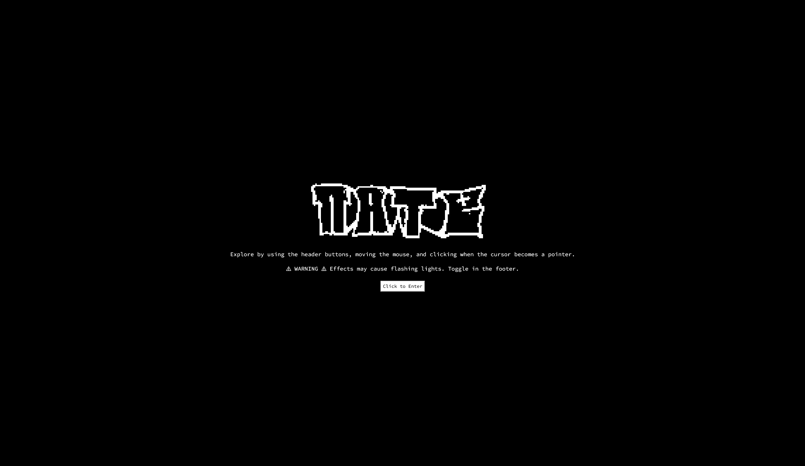
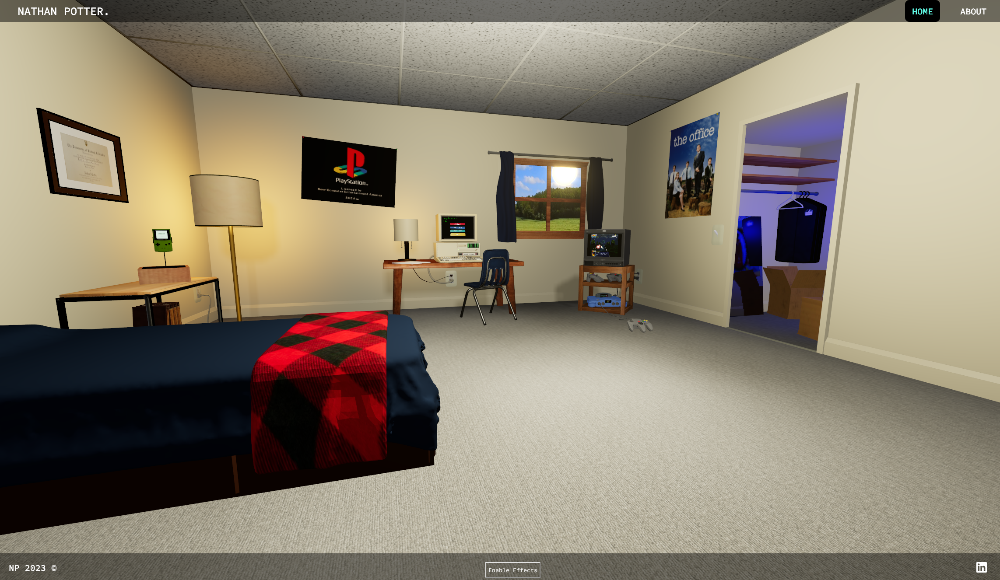
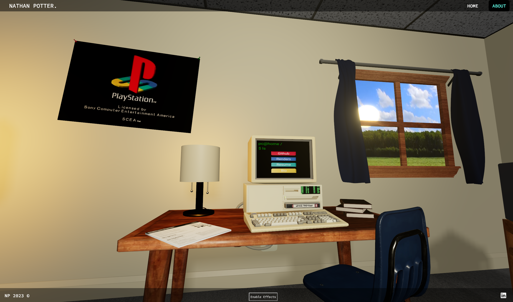
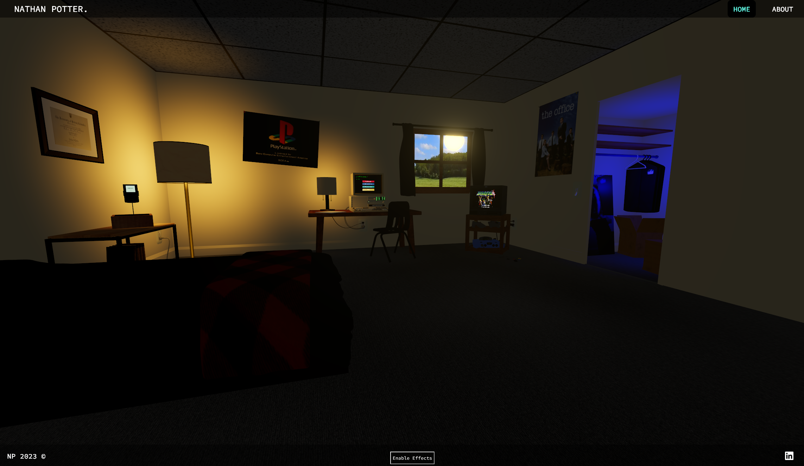
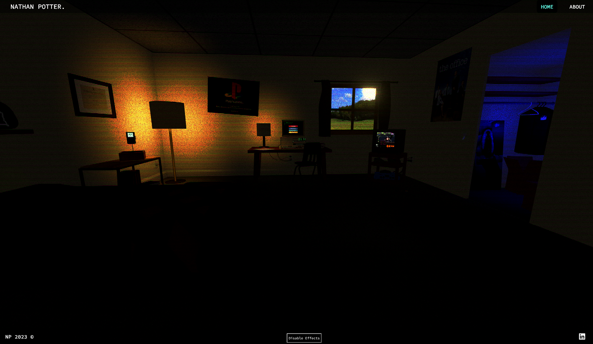

# Nathan Potter's React Three Fiber Portfolio Site
Weblink: [https://nathanpotter17.github.io/](https://nathanpotter17.github.io/)

10/12/2022 - v1.0 Mobile Pre-Release - "Thanks to all the help from open source information, Welcome to the first 'Mobile Ready' version of nathanpotter.tech!"

10/12/2023 - v2.0 JSX Refactor - "Thanks goes out to Pmndrs, SBCode, Hugo Wiledal, & all the contributors to @react-three/fiber for providing such amazing tools for creators to get involved with. At this time, this build is meant for desktop, but I look forward to providing mobile support as well. Be patient for loading (the funny messages are worth it) and enjoy!"

